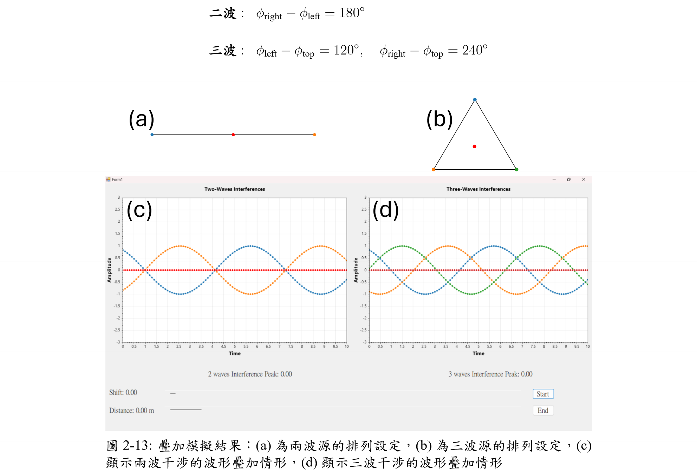
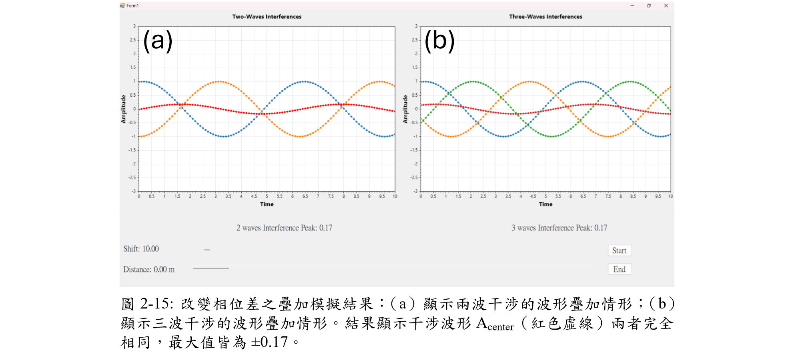
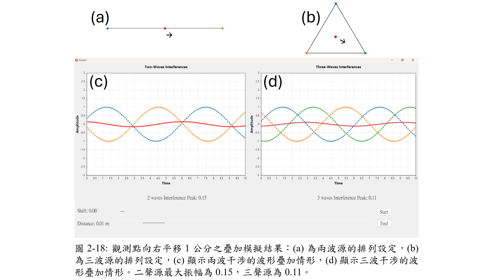

# C# Simulation – Interference Peak | 干涉峰值模擬

This project simulates the variation in destructive interference when modifying either the **phase shift** $\phi$ or the **observation position** $r$ in a classical spherical wave function. The application is implemented in C# and provides visual output of interference peak responses under parameter control.

本專案以 C# 編寫，模擬在球面波形式下，只改變「相位 $\phi$」或「觀察點位置 $r$」時，對於**破壞性干涉（destructive interference）峰值位置的影響**。畫面中會即時顯示干涉峰值的變化情形。

---

## 📐 Governing Equation | 波函數模型

The wave function used in this simulation is defined as:

\[
A(r, t) = D(r) \cos(kr - \omega t + \phi)
\]

其中：

- $D(r)$：距離相關的振幅衰減項  
- $k$：wavevector
- $\omega$：角頻率  
- $\phi$：初始相位  
- $r$：觀察點距離波源的距離 
- $t$：時間

---

## 🖼️ Screenshot Description | 圖片說明

### page27.png — Initial Condition | 初始設定畫面

- Default values of $\phi$ and $r$  
- 觀察點位置與相位皆為預設值，作為對照基準

---

### page29.png — Change Phase Only | 僅改變相位 $\phi$

- $\phi$ has been adjusted while $r$ remains fixed  
- 在固定觀察點下，變化 $\phi$ 導致干涉峰值的改變效果

---

### page32.png — Change Observation Point Only | 僅改變觀察點位置 $r$

- Observation point $r$ changed, phase $\phi$ fixed  
- 當 $\phi$ 不變時，移動觀察位置造成干涉峰值的改變效果

---

## 🔧 Requirements | 執行環境

- Windows 系統
- Visual Studio 2022+
- .NET Framework / .NET Core（依專案設定）

---

## 📌 Notes | 備註

This simulation helps visualize how a spherical wave's destructive interference depends on **either the phase shift $\phi$ or spatial variation $r$**.

本模擬有助於理解在球面波疊加下，**相位與空間參數對干涉結果的敏感性**。

